# 🔗 URL Shortener Service


A production-style **Spring Boot REST API** for creating, managing, and redirecting shortened URLs with authentication, caching, analytics, expiration, custom aliases, and rate limiting.

Built to demonstrate modern backend development practices using **Java 17**, **Spring Boot**, **Spring Security (JWT)**, **MySQL**, **Redis**, **Docker**, and comprehensive **Unit & Integration Testing**.

## 🚀 Highlights

- JWT Authentication & Ownership-Based Authorization
- Base62-based Short URL Generation
- Redis Cache-Aside Caching for URL Redirection
- Custom URL Aliases with Reserved Keyword Validation
- URL Expiration and Validation
- Asynchronous Click Analytics using Spring `@Async`
- IP-Based Rate Limiting
- RESTful APIs documented with Swagger / OpenAPI
- MySQL Database Persistence with Spring Data JPA
- Dockerized Application with Docker Compose
- Unit & Integration Testing with JUnit 5, Mockito & MockMvc

---

## Table of Contents

- [Overview](#overview)
- [Features](#features)
- [Architecture](#architecture)
- [Tech Stack](#tech-stack)
- [API Documentation](#api-documentation)
- [Screenshots](#screenshots)
- [Getting Started](#getting-started)
- [Environment Variables](#environment-variables)
- [Running with Docker 🐳](#running-with-docker)
- [Running Locally](#running-locally)
- [Testing](#testing)
- [Future Improvements](#future-improvements)
- [Author](#author)

---

## Overview

URL Shortener Service is a production-style **Spring Boot REST API** that allows authenticated users to create and manage shortened URLs. The service generates compact short codes using **Base62 encoding** and redirects users to the original URLs while tracking usage through click analytics.

The project follows a **layered architecture** with clear separation of concerns using Controllers, Services, Repositories, DTOs, and Entities. It demonstrates modern backend development practices including **JWT-based authentication**, **ownership-based authorization**, **Redis caching**, **URL expiration**, **custom aliases**, **asynchronous analytics**, **IP-based rate limiting**, **request validation**, **global exception handling**, **Dockerized deployment**, and **unit & integration testing**.

The primary goal of this project is to demonstrate the design and implementation of a scalable backend service while applying practical concepts such as **caching, asynchronous processing, API security, database persistence, and rate limiting**.

---
<p align="right">(<a href="#table-of-contents">Back to top ↑</a>)</p>

## Features

### Authentication & Authorization

- JWT-based authentication
- Secure password hashing using BCrypt
- Protected REST endpoints using Spring Security
- Ownership-based authorization for user-specific URL resources

### URL Shortening

- Generate compact short URLs using **Base62 encoding**
- Create shortened URLs from long URLs
- Retrieve URL metadata
- Redirect short URLs to their original destinations
- Support for custom aliases
- Validation for duplicate and system-reserved aliases

### URL Expiration

- Optional URL expiration using configurable TTL in days
- Prevent access to expired short URLs
- Expiration status included in URL analytics

### Redis Caching

- Implemented **cache-aside caching** using Redis
- Cache frequently accessed original URLs
- Reduce repeated database lookups during redirection
- Automatic cache expiration using TTL

### Click Analytics

- Track the number of clicks for each shortened URL
- Asynchronous click-count updates using Spring `@Async`
- Analytics endpoint providing URL usage information
- Track creation time and expiration status

### Rate Limiting

- IP-based rate limiting for API requests
- Separate handling for authenticated and unauthenticated requests
- HTTP `429 Too Many Requests` responses when limits are exceeded
- Retry information provided through response headers

### API Design

- RESTful API design
- Request/Response DTO pattern
- Centralized global exception handling
- Request validation using Jakarta Bean Validation
- Consistent HTTP status codes and error responses

### Database

- MySQL relational database
- Spring Data JPA with Hibernate
- User-to-URL ownership relationships
- Repository-level queries for retrieving authenticated users' URLs

### Testing Coverage

- Unit testing with JUnit 5 and Mockito
- REST API integration testing with MockMvc
- Authentication and authorization test coverage
- URL creation and redirection testing
- Rate limiting integration tests
- Validation and exception handling tests

### DevOps & Tooling

- Dockerized Spring Boot application
- Docker Compose for application, MySQL, and Redis
- Health checks for container dependencies
- Swagger / OpenAPI API documentation
- Postman collection for API testing
- Spring Boot Actuator and Prometheus metrics

---
<p align="right">(<a href="#table-of-contents">Back to top ↑</a>)</p>

## Architecture

**Contents**
- [High-Level Architecture](#high-level-architecture)
- [Layered Architecture](#layered-architecture)
- [URL Creation Flow](#url-creation-flow)
- [URL Redirection & Cache Flow](#url-redirection--cache-flow)
- [JWT Authentication Flow](#jwt-authentication-flow)
- [Asynchronous Analytics Flow](#asynchronous-analytics-flow)
- [Source Code Organization](#source-code-organization)
- [Database ER Diagram](#database-er-diagram)

The URL Shortener Service follows a **layered architecture** with clear separation of concerns between the presentation, business, persistence, security, caching, and analytics components.

The application uses **MySQL as the persistent data store** and **Redis as a caching layer** to optimize frequently accessed URL redirections. Spring Security handles JWT authentication and authorization, while asynchronous processing is used for click analytics to keep the redirection path lightweight.

The diagrams below provide a high-level overview of the application's architecture, URL creation and redirection flows, security mechanism, asynchronous analytics processing, project organization, and database design.

### High-Level Architecture

> Shows how requests flow through the application and how the backend interacts with MySQL and Redis.

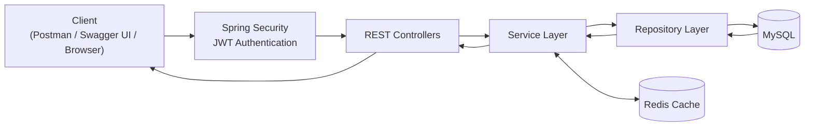

---

### Layered Architecture

> Illustrates the responsibilities and dependencies of each application layer.

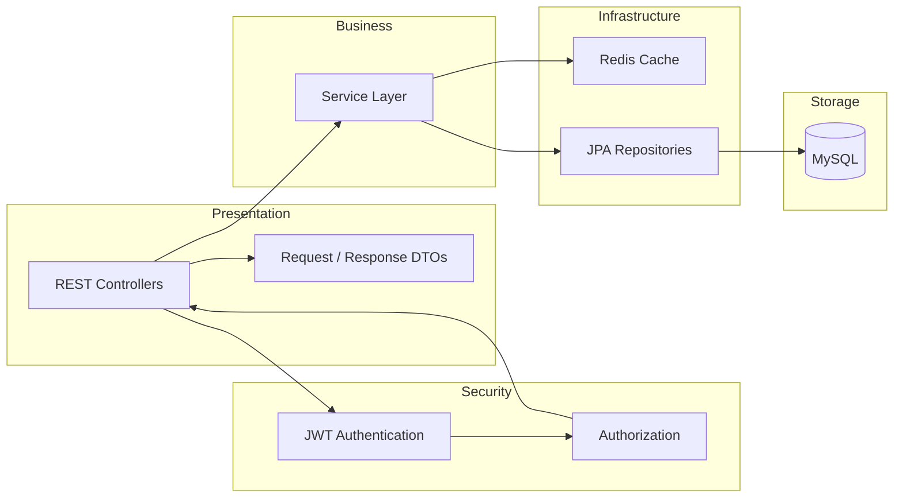

---

### URL Creation Flow

> Shows the lifecycle of a request for creating a shortened URL.

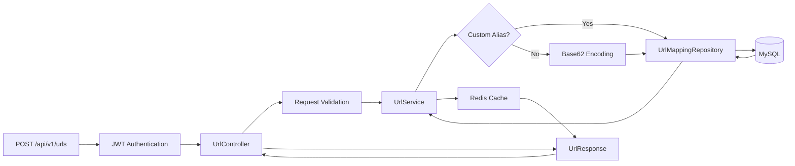

---

### URL Redirection & Cache Flow

> Shows how Redis reduces database lookups during short URL redirection.

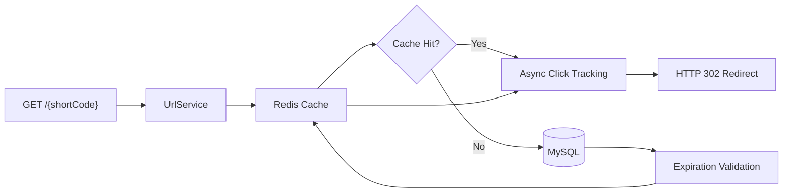

---

### JWT Authentication Flow

> The application secures protected endpoints using Spring Security and JWT authentication. After a successful login, the client includes the JWT token with subsequent protected requests.

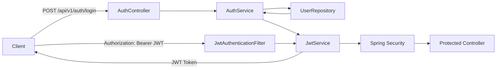

---

### Asynchronous Analytics Flow

> Click tracking is performed asynchronously so analytics updates do not unnecessarily block the URL redirection flow.

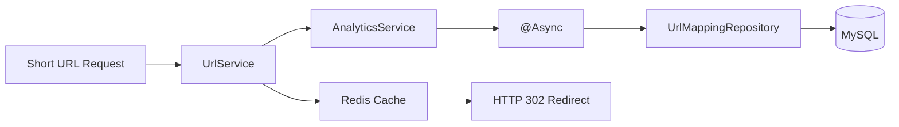

---

### Source Code Organization

> High-level organization of the source code.

```text
src
├── main
│   ├── java/com/jana/url_shortener
│   │
│   ├── config/                 # Application configuration
│   │   ├── AsyncConfig
│   │   ├── OpenApiConfig
│   │   ├── RateLimitingInterceptor
│   │   ├── RedisConfig
│   │   ├── SecurityConfig
│   │   └── WebConfig
│   │
│   ├── controller/             # REST Controllers
│   │   ├── AuthController
│   │   ├── RedirectController
│   │   └── UrlController
│   │
│   ├── dto/                    # Request & Response DTOs
│   │
│   ├── entity/                 # JPA Entities & Enums
│   │   ├── Role
│   │   ├── UrlMapping
│   │   └── User
│   │
│   ├── exception/              # Global Exception Handling
│   │   ├── GlobalExceptionHandler
│   │   └── ResourceNotFoundException
│   │
│   ├── repository/             # Spring Data JPA Repositories
│   │   ├── UrlMappingRepository
│   │   └── UserRepository
│   │
│   ├── security/               # JWT & Spring Security
│   │   ├── CustomUserDetails
│   │   ├── CustomUserDetailsService
│   │   ├── JwtAuthenticationEntryPoint
│   │   ├── JwtAuthenticationFilter
│   │   └── JwtUtils
│   │
│   ├── service/                # Business Logic
│   │   ├── AnalyticsService
│   │   ├── AuthService
│   │   ├── RateLimitingService
│   │   ├── RedisCacheService
│   │   └── UrlService
│   │
│   └── util/                   # Utility Classes
│       └── Base62Util
│
│   └── resources
│       └── application.properties
│
└── test
    ├── java/com/jana/url_shortener
    │   ├── controller/         # Integration Tests
    │   ├── service/            # Unit Tests
    │   └── util/               # Utility Tests
    │
    └── resources
        └── application-test.properties
```

---

### Database ER Diagram

> Entity relationship between users and their shortened URLs.

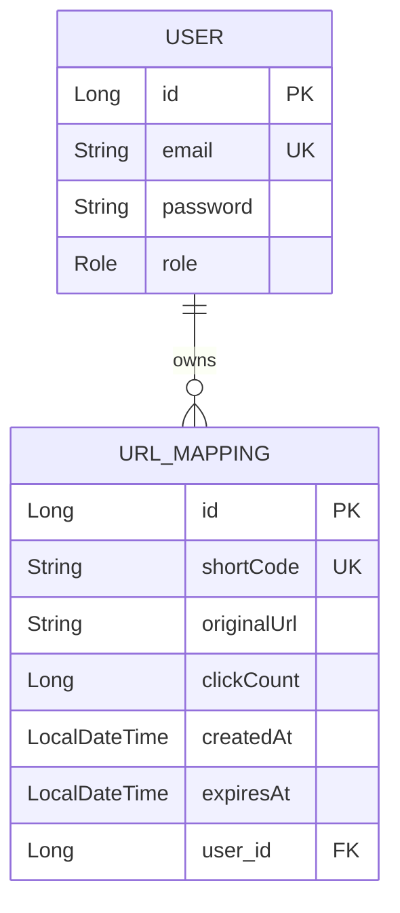

---
<p align="right">(<a href="#table-of-contents">Back to top ↑</a>)</p>

## Tech Stack

| Category | Technologies |
|----------|--------------|
| Language | Java 17 |
| Framework | Spring Boot 3.5 |
| Build Tool | Maven |
| Database | MySQL 8 |
| ORM | Spring Data JPA (Hibernate) |
| Caching | Redis |
| Security | Spring Security, JWT |
| Validation | Jakarta Bean Validation |
| API Documentation | Swagger / OpenAPI |
| Asynchronous Processing | Spring `@Async` |
| Rate Limiting | Bucket4j |
| Testing | JUnit 5, Mockito, MockMvc |
| Containerization | Docker, Docker Compose |
| Monitoring | Spring Boot Actuator, Prometheus |
| API Testing | Postman |
| Version Control | Git, GitHub |

<p align="right">(<a href="#table-of-contents">Back to top ↑</a>)</p>

## API Documentation

The REST APIs are documented using **Swagger / OpenAPI**, providing an interactive interface for exploring and testing the available endpoints.

Once the application is running, the documentation can be accessed at:

| Tool | URL |
|------|-----|
| Swagger UI | `http://localhost:8080/swagger-ui/index.html` |
| OpenAPI Specification | `http://localhost:8080/v3/api-docs` |

### API Endpoints

| Method | Endpoint | Authentication | Description |
|--------|----------|----------------|-------------|
| `POST` | `/api/v1/auth/register` | Public | Register a new user |
| `POST` | `/api/v1/auth/login` | Public | Authenticate and obtain a JWT |
| `POST` | `/api/v1/urls` | JWT Required | Create a shortened URL |
| `GET` | `/api/v1/urls` | JWT Required | Retrieve the authenticated user's URLs |
| `GET` | `/api/v1/urls/{id}` | JWT Required | Retrieve URL metadata |
| `GET` | `/api/v1/urls/{id}/analytics` | JWT Required | Retrieve click analytics |
| `GET` | `/{shortCode}` | Public | Redirect to the original URL |

### Authentication

Protected endpoints require a **JWT access token**.

1. Register a user using `POST /api/v1/auth/register`.
2. Login using `POST /api/v1/auth/login`.
3. Copy the returned JWT token.
4. Click the **Authorize** button in Swagger UI.
5. Enter the token in the following format:

```text
Bearer <your-jwt-token>
```
After authorization, protected endpoints can be tested directly from Swagger UI.

---
<p align="right">(<a href="#table-of-contents">Back to top ↑</a>)</p>

## Screenshots

The following screenshots demonstrate the application's key features and verify that the backend APIs are functioning correctly.

### Swagger UI

Interactive API documentation generated using **OpenAPI / Swagger**.

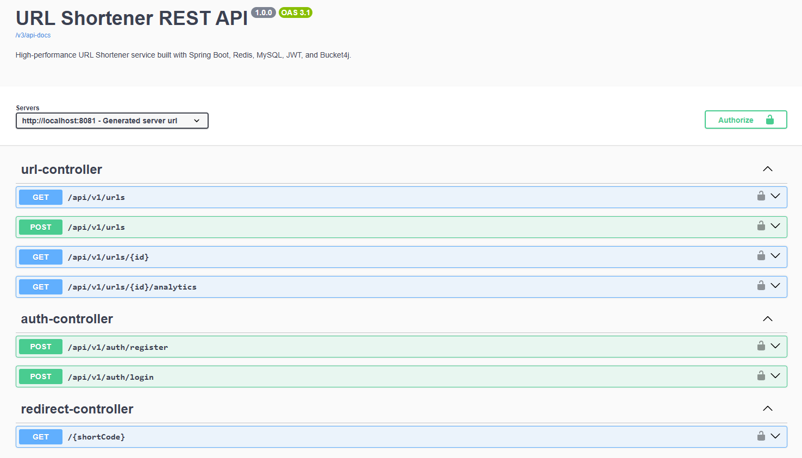

---

### JWT Authentication

Authenticating through Swagger using a JWT Bearer Token.

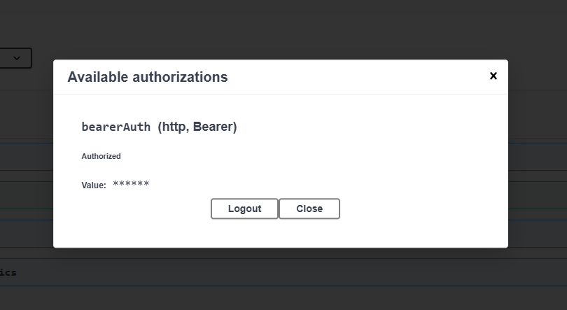

---

### Create Short URL

Creating a shortened URL with optional custom alias and expiration.

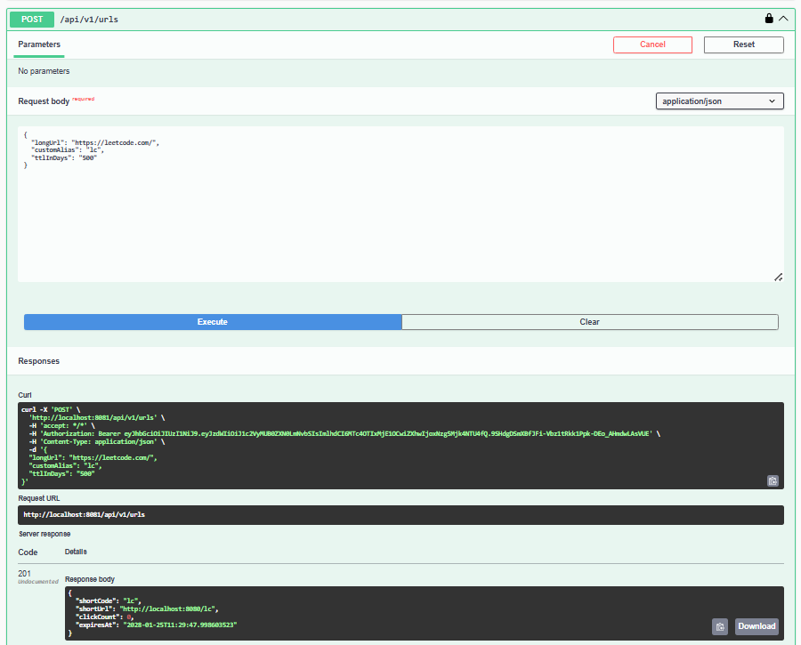

---

### URL Redirection

Accessing a generated short URL and redirecting to the original destination.

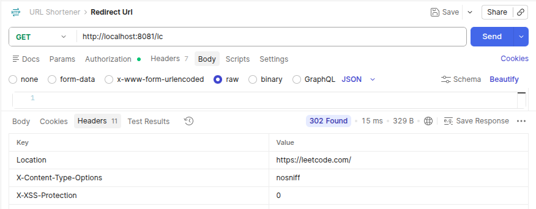

---

### URL Analytics

Retrieving click analytics and metadata for a shortened URL.

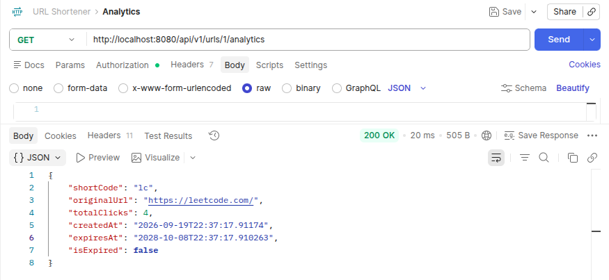

---

### Redis Caching

Redis running alongside the application and MySQL using Docker Compose.

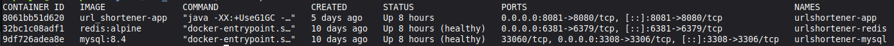

---

### Rate Limiting

Demonstrating the API rejecting requests after the configured rate limit is exceeded.

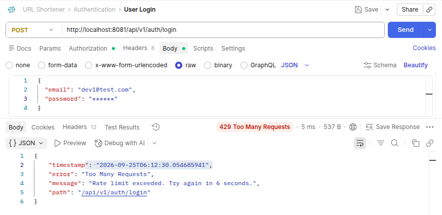

---

### Automated Tests

All unit and integration tests passing successfully.

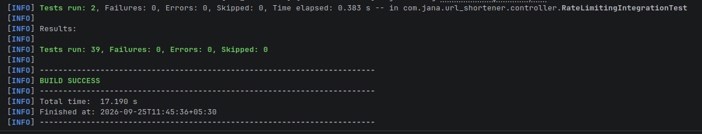

---
<p align="right">(<a href="#table-of-contents">Back to top ↑</a>)</p>

## Getting Started

Follow the steps below to set up and run the project.

### Prerequisites

Install the following tools before getting started:

- Java 17
- Maven 3.9+
- Git
- Docker & Docker Compose (recommended)

Clone the repository:

```bash
git clone https://github.com/DipuJana/url_shortener.git

cd url_shortener
```
<p align="right">(<a href="#table-of-contents">Back to top ↑</a>)</p>

## Environment Variables

The application uses environment variables for sensitive configuration and external service settings.

Create a `.env` file in the project root and configure the following variables:

```env
JWT_EXPIRATION_MS=
JWT_SECRET=

SPRING_DATA_REDIS_HOST=
SPRING_DATA_REDIS_PORT=

SPRING_DATASOURCE_URL=
SPRING_DATASOURCE_USERNAME=
SPRING_DATASOURCE_PASSWORD=
```

### Variable Description
| Variable | Description |
|----------|-------------|
| `JWT_EXPIRATION_MS` | JWT token expiration time in milliseconds |
| `JWT_SECRET` | Secret key used for signing and validating JWT tokens |
| `SPRING_DATA_REDIS_HOST` | Redis server hostname |
| `SPRING_DATA_REDIS_PORT` | Redis server port |
| `SPRING_DATASOURCE_URL` | JDBC URL used to connect to MySQL |
| `SPRING_DATASOURCE_USERNAME` | MySQL database username |
| `SPRING_DATASOURCE_PASSWORD` | MySQL database password |

<p align="right">(<a href="#table-of-contents">Back to top ↑</a>)</p>

## Running with Docker

Start the complete application stack using Docker Compose:
```bash
docker compose up -d --build
```
This starts:

Spring Boot application
MySQL database
Redis cache

Verify that all containers are running:
```bash
docker compose ps
```
The application will be available at:

`http://localhost:8081`

Swagger UI:

`http://localhost:8081/swagger-ui/index.html`

### Stopping the Application
Stop the running containers:

```bash
docker compose stop
```

Start the existing containers again without rebuilding:

```bash
docker compose start
```

To stop and remove the containers:

```bash
docker compose down
```

<p align="right">(<a href="#table-of-contents">Back to top ↑</a>)</p>

## Running Locally

Using the Maven wrapper:

``` bash
./mvnw spring-boot:run
```

Or using Maven:

``` bash
mvn spring-boot:run
```

The application will be available at:

`http://localhost:8080`

Swagger UI:

`http://localhost:8080/swagger-ui/index.html`

<p align="right">(<a href="#table-of-contents">Back to top ↑</a>)</p>

## Testing

The project includes both unit tests and integration tests to verify business logic, REST APIs, authentication, authorization, URL redirection, and rate limiting.

Run All Tests

Using the Maven wrapper:

```bash
./mvnw test
```

Or using Maven:

```bash
mvn test
```

### Test Coverage

The test suite includes:

- Service-layer unit tests using **JUnit 5** and **Mockito**
- REST API integration tests using **MockMvc**
- JWT authentication tests
- Authentication and authorization tests
- URL creation and redirection tests
- URL ownership validation tests
- Rate limiting integration tests
- Base62 utility tests
- Validation and exception handling tests

A successful test run should complete without test failures.

<p align="right">(<a href="#table-of-contents">Back to top ↑</a>)</p>

## Future Improvements

Potential improvements that can be added as the project evolves:

- Custom domain support for shortened URLs
- Advanced click analytics and reporting
- QR code generation for shortened URLs
- URL deletion and management
- Pagination for user URL listings
- Improved caching strategies for high-traffic URLs
- Production deployment with a cloud platform
- Centralized logging and monitoring
- Automated CI/CD deployment pipeline

---

<p align="right">(<a href="#table-of-contents">Back to top ↑</a>)</p>

## Author

**Dipanjan Jana**

- GitHub: https://github.com/DipuJana
- LinkedIn: https://www.linkedin.com/in/dipanjan-jana-96ba2827a/

If you found this project useful or have suggestions for improvement, feel free to open an issue or connect with me.

<p align="right">(<a href="#table-of-contents">Back to top ↑</a>)</p>
